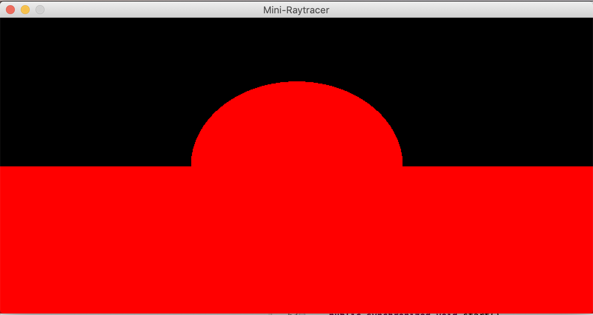
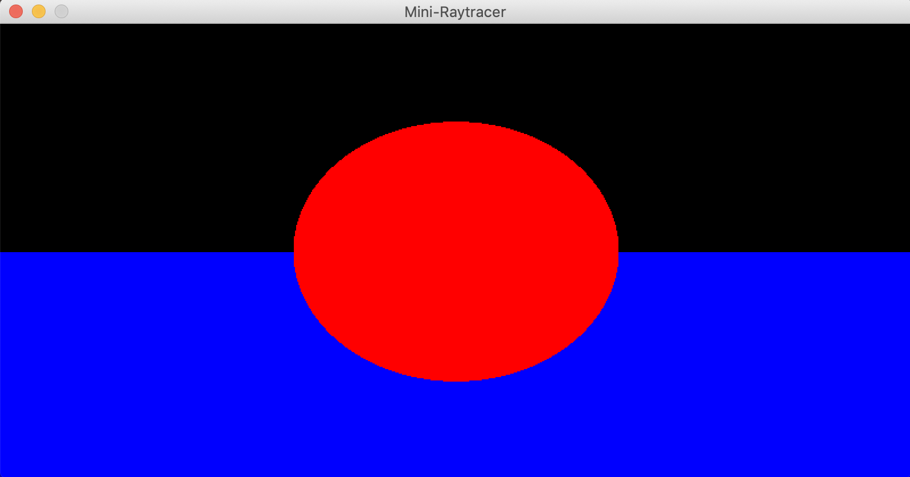
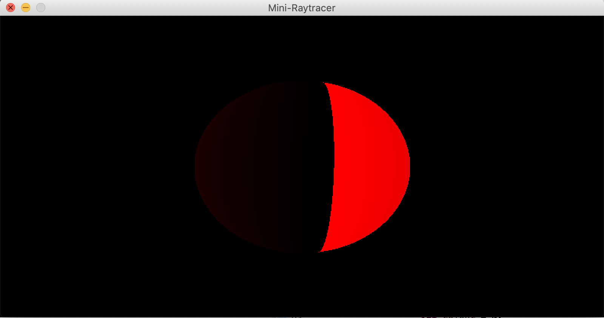
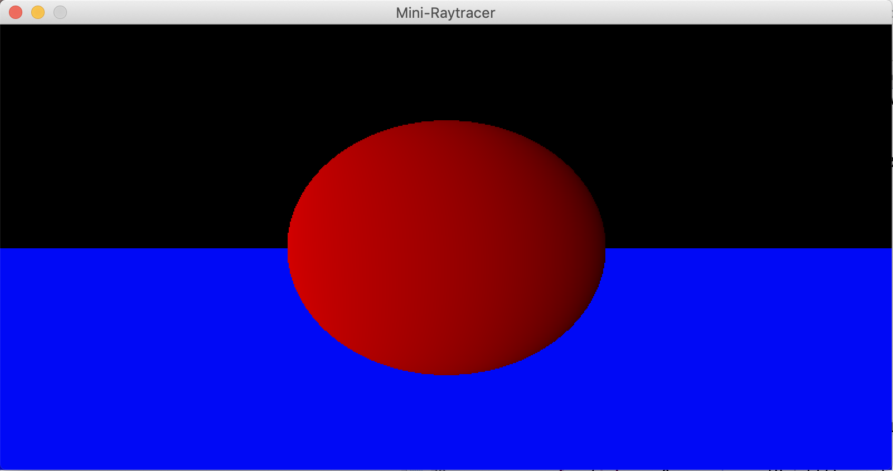

# Mini Raytracer
A ray tracer is a method of drawing 3D images on the screen through the use of math.
So after doing a computer graphics course I thought I would give a go at creating a 
Sphere

I have log how it changed over time below

## Versions

### v0.1 - an outline of the shape

* This version we have created the plane and sphere class
* created a window using a BufferedImage
* Created a vector3D class
* Created a camera class
* And go the outline of the shapes in a scene drawn

TO DO:
* Colour
* Shadows
* reflections
* refraction

### v0.2 - add colour

* Colour has been added to shapes so we can tell them apart

TO DO:
* Shadows
* reflections
* refraction

### v0.2.5 - Adding shadows

* Added the first version of shadows

### v0.2.7.5 - Adding shadows

* Sphere renders the correct shadows

TO DO:
* Add shadow to plane

## References
* [Ray Tracer #4: Rays and Intersections By HillsoftCode](https://www.youtube.com/watch?v=hOeOuZGmeCM)
* [Raytracing - Ray Sphere Intersection By Victor Li](https://viclw17.github.io/2018/07/16/raytracing-ray-sphere-intersection/)
